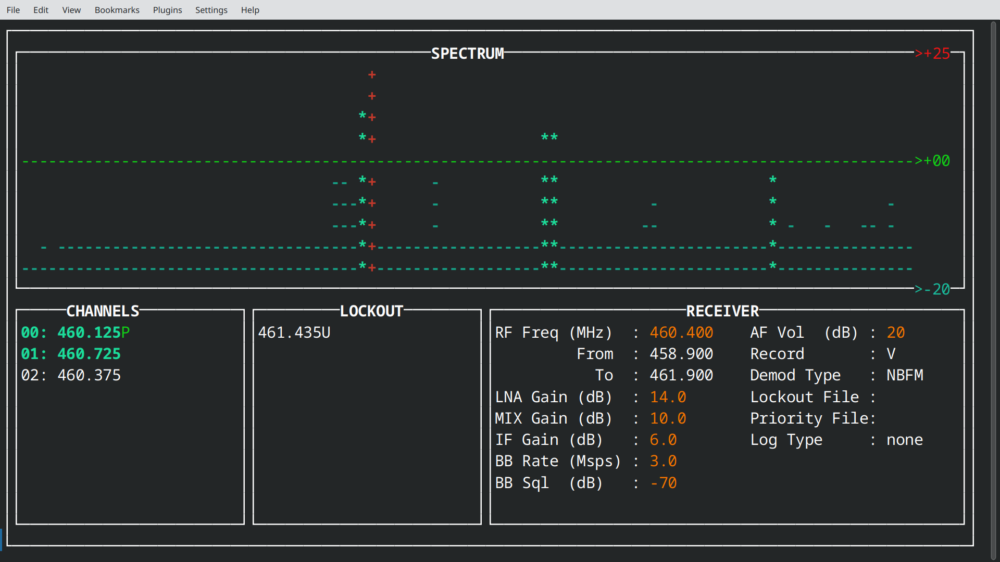

# HAM2MON
This is a GNU Radio (GR) based SDR scanner with a Curses interface, primarily meant for monitoring amateur radio narrow-band FM modulation and air-band AM modulation.  It should work with any GrOsmoSDR source capable of at least 1 Msps.  Unlike conventional radio scanners that lock and demodulate a single channel, this SDR scanner can demodulate and record audio from N channels in parallel within the digitizing bandwidth.  The N (number of) channels is basically just limited by processor speed.  A video detailing the project may be found here:

http://youtu.be/BXptQFSV8E4



## Tested with:

This fork been tested with:

- Airspy Mini (https://airspy.com/airspy-mini/)
- RTL-SDR v3 RTL2832 + R820T at 2 Msps (http://rtl-sdr.com)
- RTL-SDR NOOELEC NESDR+ (RTL2838 DVB-T)

Note: This fork is expected with the following SDRs:

- GNU Radio 3.8.2.0 (https://github.com/gnuradio/gnuradio)
- GrOsmoSDR 0.1.4-29 (http://sdr.osmocom.org/trac/wiki/GrOsmoSDR)
- Ettus B200 at 16 Msps (http://www.ettus.com)
- NooElec RTL2832 + R820T at 2 Msps (http://www.nooelec.com)
- GNU Radio 3.7.10 (https://github.com/gnuradio/gnuradio)
- GrOsmoSDR 0.1.4 (http://sdr.osmocom.org/trac/wiki/GrOsmoSDR)
- Ettus UHD 3.10.0 (https://github.com/EttusResearch/uhd)

This fork has only been tested with recent versions of python 3.  It will not work with python 2.7.

## Contributors:

lordmorgul:
- Min and max spectrum switches
- Python3 builtin functions correction for priority and lockout parsing
- Example priority and lockout files
- Spectrum bar coloration (min/threshold/max)
- Active channel tracking and coloration
- GUI adjustments in channel and receiver windows, borders and labels
- priority, lockout, and text log file name displays
- pulled logger framework from kibihrchak and revised to python3
- log file framework with enable flags (to prepare for multiple loggers implemented, text and database)
- log file timeout so active channels are indicated only every TIMEOUT seconds
- pulled long run demodulator fix to python3 version from john
- pulled gain corrections to python3 version from john
- channel width configurable from command line option
- incorporate miweber67 freq range limits
- WBFM support
- CTCSS support (in progress)

miweber67
- frequency range to limit selected channels to within specific limit

kibihrchak:
- Logger branch text file log entries

oneineight:
- Python 3 support

bkerler:
- gnuradio 3.10/3.11 support

m0mik:
- Added HackRF IF/BB gain parameters
- Added 1dB shift option to threshold and gain settings

atpage:
- Fixed typos

john:
- Frequency correction option switch
- Read from I/Q file documentation
- Bits per audio sample (bps) option switch
- min/max recording
- dynamic gui sizing
- recording classification
- debug file option
- revamped lockout handling

lachesis:
- Mute switch
- Simplified TunerDemod class
- Removed 44 byte header-only files

madengr:
- Initial code
- AM demodulation
- Priority channels

## Console Operation:
The following is an example of the option switches for UHD with NBFM demodulation, although omission of any will use default values (shown below) that are optimal for the B200:

./ham2mon.py -a "uhd" -n 8 -d 0 -f 146E6 -r 4E6 -g 30 -s -60 -v 0 -t 10 -w

The following is an example of the option switches for UHD with AM demodulation, primarily meant for VHF air band reception.  Note the squelch has been lowered 10 dB to aid with weak AM detection:

./ham2mon.py -a "uhd" -n 8 -d 1 -f 135E6 -r 4E6 -g 30 -s -70 -v 0 -t 10 -w

The following is an example of the option switches for RTL2832U.  Note the sample rate, squelch, and threshold have changed to reflect the reduced (8-bit) dynamic range of the RTL dongles compared to Ettus SDRs.  In addition, these devices have poor IMD and image suppression, so strong signals may cause false demodulator locks:

./ham2mon.py -a "rtl" -n 4 -f 145E6 -r 2E6 -g 20 -s -40 -v 0 -t 30 -w

Note that sometimes default RTL kernel driver (for receiving dvb) must be disabled.  Google "rtl sdr blacklist" to read more about this issue, or just do this:

sudo rmmod dvb_usb_rtl28xxu

Example of reading from an IQ file:

./ham2mon.py -a "file=gqrx.raw,rate=8E6,repeat=false,throttle=true,freq=466E6" -r 8E6 -w

## GUI Controls:
`t/r = Detection threshold +/- 5 dB. (T/R for +/- 1dB)`

`p/o = Spectrum upper scale +/- 5 dB`

`w/q = Spectrum lower scale +/- 5 dB`

`g/f = 1st gain element +/- 10 dB (G/F for +/- 1dB)`

`u/y = 2nd gain element +/- 10 dB (U/Y for +/- 1dB)`

`]/[ = 3rd gain element +/- 10 dB (}/{ for +/- 1dB)`

`s/a = Squelch +/- 1 dB`

`./, = Volume +/- 1 dB`

`k/j = RF center frequency +/- 100 kHz`

`m/n = RF center frequency +/- 1 MHz`

`v/c = RF center frequency +/- 10 MHz`

`x/z = RF center frequency +/- 100 MHz`

`0..9 = Lockout channel (must press during reception)`

`l = Clear lockouts`

`/ = Frequency entry mode (Esc to exit)`

`CTRL-C or SHIFT-Q = quit`

## Help Menu
```
Usage: ham2mon.py [options]

options:
  -h, --help            show this help message and exit
  -a HW_ARGS, --args HW_ARGS
                        Hardware args
  -n NUM_DEMOD, --demod NUM_DEMOD
                        Number of demodulators
  -d TYPE_DEMOD, --demodulator TYPE_DEMOD
                        Type of demodulator (0=NBFM, 1=AM and 2=WBFM)
  -f FREQ_SPEC [FREQ_SPEC ...], --freq FREQ_SPEC [FREQ_SPEC ...]
                        Hardware RF center frequency or range in Hz
  --quiet_timeout QUIET_TIMEOUT
                        Timeout when there is no activity
  --active_timeout ACTIVE_TIMEOUT
                        Timeout when there is activity
  -r ASK_SAMP_RATE, --rate ASK_SAMP_RATE
                        Hardware ask sample rate in sps (1E6 minimum)
  -g RF_GAIN_DB, --gain RF_GAIN_DB, --rf_gain RF_GAIN_DB
                        Hardware RF gain in dB
  -i IF_GAIN_DB, --if_gain IF_GAIN_DB
                        Hardware IF gain in dB
  -o BB_GAIN_DB, --bb_gain BB_GAIN_DB
                        Hardware BB gain in dB
  --lna_gain LNA_GAIN_DB
                        Hardware LNA gain in dB
  --att_gain ATT_GAIN_DB
                        Hardware ATT gain in dB
  --lna_mix_bb_gain LNA_MIX_BB_GAIN_DB
                        Hardware LNA_MIX_BB gain in dB
  --tia_gain TIA_GAIN_DB
                        Hardware TIA gain in dB
  --pga_gain PGA_GAIN_DB
                        Hardware PGA gain in dB
  --lb_gain LB_GAIN_DB  Hardware LB gain in dB
  -x MIX_GAIN_DB, --mix_gain MIX_GAIN_DB
                        Hardware MIX gain index
  --agc                 Enable automatic gain control
  -s SQUELCH_DB, --squelch SQUELCH_DB
                        Squelch in dB
  -v VOLUME_DB, --volume VOLUME_DB
                        Volume in dB
  -t THRESHOLD_DB, --threshold THRESHOLD_DB
                        Threshold in dB
  -w, --write           Record (write) channels to disk
  -l LOCKOUT_FILE_NAME, --lockout LOCKOUT_FILE_NAME
                        YAML lockout file containing frequencies and ranges in Mhz
  -p PRIORITY_FILE_NAME, --priority PRIORITY_FILE_NAME
                        File of EOL delimited priority channels in Hz
                        (descending priority order)
  -P, --auto-priority   Automatically add voice channels as priority channels
  -T CHANNEL_LOG_TYPE, --log_type CHANNEL_LOG_TYPE
                        Log file type for channel detection
  -L CHANNEL_LOG_TARGET, --log_target CHANNEL_LOG_TARGET
                        Log file or endpoint for channel detection
  -A CHANNEL_LOG_TIMEOUT, --log_active_timeout CHANNEL_LOG_TIMEOUT
                        Timeout delay for active channel log entries
  -c FREQ_CORRECTION, --correction FREQ_CORRECTION
                        Frequency correction in ppm
  -m, --mute-audio      Mute audio from speaker (still allows recording)
  -b AUDIO_BPS, --bps AUDIO_BPS
                        Audio bit depth (bps)
  -M MAX_DB, --max_db MAX_DB
                        Spectrum window max dB for display
  -N MIN_DB, --min_db MIN_DB
                        Spectrum window min dB for display (no greater than
                        -10dB from max
  -B CHANNEL_SPACING, --channel-spacing CHANNEL_SPACING
                        Channel spacing (spectrum bin size)
  --min_recording MIN_RECORDING
                        Minimum length of a recording in seconds
  --max_recording MAX_RECORDING
                        Maximum length of a recording in seconds
  --voice               Record voice
  --data                Record voice
  --skip                Record voice
  --model MODEL_FILE_NAME
                        Classification model file in tflite format
  --debug               Enable debug file with additional information
                        (ham2mon.log)
```
Note: The available gains are hardware specific.  The user interface will list the gains available based on hardware option supplied to ham2mon.

## Description:
The high speed signal processing is done in GR and the logic & control in Python. There are no custom GR blocks.  The GUI is written in Curses and is meant to be lightweight.  See the video for a basic overview.  I attempted to make the program very object oriented and “Pythonic”.  Each module runs on it's own for testing purposes.


See the flow_example.grc for an example of the GR flow, and receiver.py for the Python coded flow.  The complex samples are grouped into a vector of length 2^n and then decimated by keeping “1 in N” vectors. The FFT is taken followed by magnitude-squared to form a power spectrum.  The FFT length is chosen, based on sample rate, to span about 3 RBW bins across a 12.5 kHz FM channel.  The spectrum vectors are then integrated and further decimated for a video average, akin to the VBW of a spectrum analyzer.  The spectrum is then probed by the Python code at ~10 Hz rate.

The demodulator blocks are put into a hierarchical GR block so multiple can be instantiated in parallel.  A frequency translating FIR filter tunes the channel, followed by two more decimating FIR filters to 12.5 kHz channel bandwidth.  For sample rates 1 Msps or greater, the total decimation for the first three stages takes the rate to 40-80 ksps.  A non-blocking power squelch silences the channel, followed by quadrature (FM) demodulation, or AGC and AM demodulation.  The audio stream is filtered to 3.5 kHz bandwidth and further decimated to 8-16 ksps.  A polyphase arbitrary resampler takes the final audio rate to a constant 8 ksps.  The audio can then be mixed with other streams, or sunk to WAV file via a blocking squelch to remove dead audio.

The scanner.py contains the control code, and may be run on on it's own non-interactively.  It instantiates the receiver.py with N demodulators and probes the average spectrum at ~10 Hz.  The spectrum is processed with estimate.py, which takes a weighted average of the spectrum bins that are above a threshold.  This weighted average does a fair job of estimating the modulated channel center to sub-kHz resolution given the RBW is several kHz.  The estimate.py returns a list of baseband channels that are rounded to the nearest 5 kHz (for NBFM band plan ambiguity).

The list used to tune the demodulators (lockout channels are skipped).  The demodulators are only tuned if the channel has ceased activity from the last probe or if a higher priority channel has activity.  Otherwise, the demodulator is held on the channel.  The demodulators are parked at 0 Hz baseband when not tuned, as this provides a constant, low amplitude signal due to FM demod of LO leakage.

The ham2mon.py interfaces the scanner.py with the curses.py GUI.  The GUI provides a spectral display with adjustable scaling and detector threshold line.  The center frequency, gain, squelch, and volume can be adjusted in real time, as well as adding channel lockouts.  The hardware arguments, sample rate, number of demodulators, recording status, and lockout file are set via switches at run time.

The default settings are optimized for an Ettus B200.  The RTL dongle will require raising the squelch and adjustment of the spectrum scale and threshold.

The next iteration of this program will probably use gr-dsd to decode P25 public safety in the 800 MHz band.

## Frequency Specification and Range Scanning
The simple case is to specify a single center frequency with the `-f` option.  With this the receiver will stay on this center frequency.

It is also possible to specify multiple center frequencies or ranges of frequencies.  For example, `-f 150.0E6 460.0E6-480.0E6`.  In this case the scanner will divide the frequencies up based into a series of steps (based on the sample rate) and iterate through those steps.

How long the scanner waits on each step is dependent on the timeouts and the presence of activity of "interest" on that step.

Currently, whether ham2mon is configured to record or not will determine how the logic behaves. These two cases determine if a channel is active:

1.  If not recording, a *channel opening* will be considered activity.
2.  If recording, the *completion of a recording* will be considered activity.

The completion of the recording does not occur until after the channel is closed and an audio file is saved.  See option `-w` and Audio Classification for saving of audio files. 

There are two timeouts.  If there is no activity on a channel the scanner will move to next step when `--quiet_timeout` is reached.  With activity, the scanner will hold until `--active_timeout` is reached.

An example use case:  Private Land Mobile Radio Service operates in the 150-174 MHz and 421-512 MHz bands.  This invocation will monitor these bands and record audio files when transmissions are 1) classified as voice 2) at least 2 seconds long 3) and no more than 10 seconds long.  If something is recorded at a specific point in these ranges the scanner will hold 60 seconds.  Otherwise, it will progress through each step every 20 seconds.

`./ham2mon.py -a "airspy" -r 3E6 -t 0 -d 0 -s -70 -v 20 -w -m -b 16 -n 3 -f 150.0E6-174E6 421.0E6-512.0E6 --voice --min_recording 2 --max_recording 10 --quiet_timeout 20 --active_timeout 60`

When range scanning, the RECEIVER section will show current step, number of steps and the percent complete.

## Automatic Gain Control (AGC)
This is a work in progress as the implementation may not function with all SDRs.  Furthermore, the UI may leave gain elements enabled that have no effect on underlying SDR.

### Underlying AGC
AGC may be *enabled* in one of two ways (SDR dependent):

- A call to set_gain_mode() in the SDR driver
  - The `--agc` option uses this method
- A hardware argument supplied to ham2mon (`-a` option)
  - This needs to be confirmed

AGC may be *configured* via hardware argument supplied to ham2mon (`-a` option):

- For example, with the Airspy Mini the AGC algorithm can be one of two types: linearity or sensitivity
    - e.g. `-a "airspy,linearity"`
- See documentation of your radio for details.

### Enabling AGC in ham2mon
AGC mode can be requested by specifying the `--agc` option to ham2mon.  Support is required in gr-osmosdr, SDR driver and the SDR hardware.  AGC is turned off by default.

With AGC, not all gain elements are used by the SDR.  the ones not used will be changeable in the UI but have no impact on the underlying hardware gain element.

For example, if AGC is specified for the Airspy Mini, the IF gain will be the only working gain element.  The others will be controlled by the SDR using its algorithm.  The UI values for the other elements will be ignored by the SDR.

## Priority File
The Priority file contains a frequency (in Hz) in each line.  The frequencies are to be arranged in descending priority order.  Therefore, the highest priority frequency will be the one at the top.

When the scanner detects a priority frequency it will demodulate that frequency over any one that is lower priority.  Priority channels with be flagged with a 'P' in the CHANNELS section.  Without a priority file the scanner will only demodulate a frequency if there is a demodulator that is inactive.

A use case for this is as follows: You want to hear something, anything, but want to hear certain things over other things if they're actually happening.  In this case there would be one demodulator being fed to the speakers. To do this, place local repeaters (in priority order) into the priority file.  If all of the repeaters are idle, other frequencies will be heard.  However, if a channel more important becomes active, those of lessor importance will be dropped in favor of the channel with more priority.

## Lockout File
The Lockout file is a YAML file that can contain individual frequencies to be locked out as well as ranges of frequencies.  All values are in Mhz (see the example for details).  Requires the `-l/--lockout` option.  

Although the user can add lockout frequencies to the active lockouts there currently is no save option to write these out to the lockout file.  However, those unsaved lockouts will be flagged with a 'U' in the LOCKOUT section.

## Channel Detection Log File
Channel events can be written to file or other targets.  Events occur when channel activity is detected as well as for ongoing activity.

By default, no channel activity is recorded.  The type can be specified with `--log_type`.  Current types include `fixed-field`, `debug` and `json-server`.  The default type is `none`.

A type may support a target through the `--log_target` option.  In the case of types the write to a file the target will be a file name.  The default target is `channel-log`.

An activity log entry is written every 15 seconds (by default).  This can be changed with `--log_active_timeout`.  Set this to 0 to disable activity logging (channel on/off messages will still occur).

If `debug` is selected as logging type than channel events can be viewed when the `--debug` option is also selected on the command line.

See [json-server example](doc/json-server_example.md) for one way this can be used.

## Auto Priority
With the `-P` option, channels that meet specific conditions will automatically be added to the priority list.  Currently, only one algorithm is supported: Voice priority.  With this, those channels that have more voice transmissions than data/skip transmissions will be added to the priority list.

Auto priority currently requires audio classification so `--voice` will automatically be enabled if this option is selected.

## Logging
Application logging events are written to `ham2mon.log`.  These are seperate from channel logging events (-L option) and are intended for application debugging.

## Audio Classification
*Note: The classification is not 100% accurate.  There will be both false positives and negatives.*

Recorded audio can be classified using a pre-trained model.  The model must be present and the tensorflow python module must be installed.  The model file can be specified with the `--model` and option.

The command line options (--voice, --data, and --skip) must be specified to indicate what recordings are saved.  All others will be discarded.  The classification feature does not impact what is heard over the speaker.  If no options are provided then classification is disabled (this is the default).  If any of the options are provided then record mode ("-w") will be automatically enabled.

The classification designator will be added after the frequency (e.g. 460.125_V_1698933610.wav for voice).  Only 16bps audio is currently supported so enable it with "-b 16".

No capability is provided to train the model.  Training data will not be provided.  Those interested in training their own model can review [xmits_train](https://gitlab.com/john---/xmits_train) for what was done to train the provided model.

## Ham2mon Development
To validate changes to ham2mon source code that may impact scanning it is best to "replay" a raw IQ file into ham2mon to confirm things are working as expected.  This can be done by first recording an IQ file(s) and then replaying it im ham2mon.

Example recording with airspy:

`airspy_rx -r case1.dump -t 0 -f 460.4 -a 3000000 -v 11 -m 10 -l 11`

This can then be replayed in ham2mon:

`./ham2mon.py -a "file=case1.dump,rate=3E6,repeat=false,throttle=true,freq=460.4E6" -r 3E6 -t 0 -d 0 -s -70 -v 20 -w -m -b 16 -n 3`