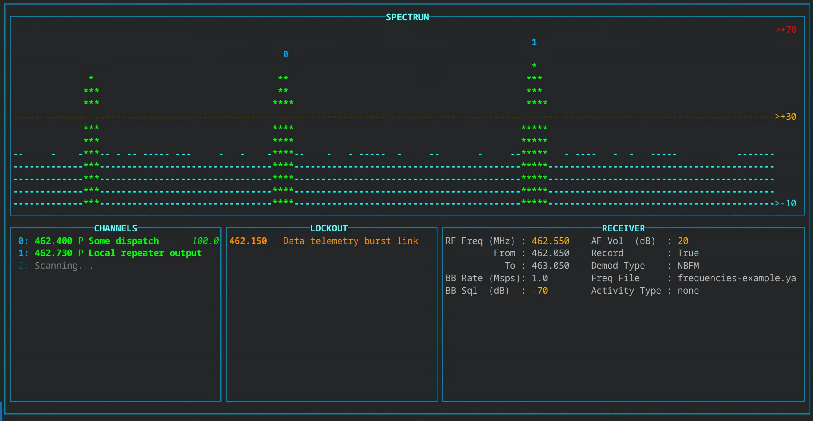
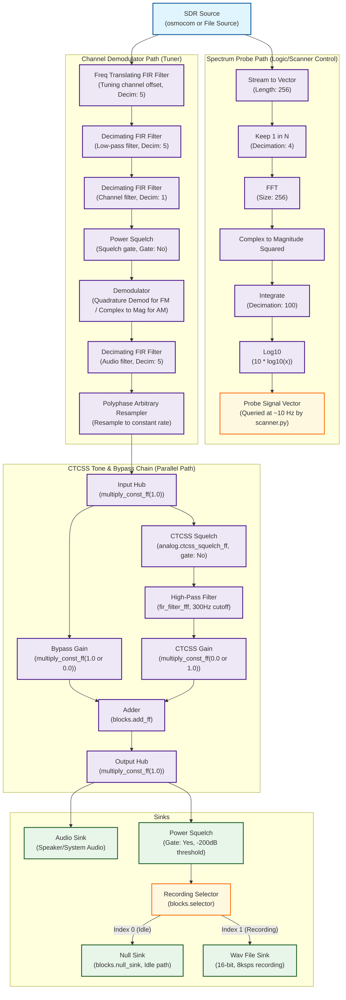

# HAM2MON
This is a GNU Radio (GR) based SDR scanner with a Curses interface, primarily meant for monitoring amateur radio narrow-band FM modulation and air-band AM modulation.  It should work with any GrOsmoSDR source capable of at least 1 Msps.  Unlike conventional radio scanners that lock and demodulate a single channel, this SDR scanner can demodulate and record audio from N channels in parallel within the digitizing bandwidth.  The N (number of) channels is basically just limited by processor speed.  A video detailing the project may be found here:

http://youtu.be/BXptQFSV8E4


This is a screenshot from a [video](doc/video.webm) showing a capture of the application running against a [simulated IQ file](doc/simulate-radio-tranmissions.md).

## Tested with:

This fork been tested with:

- Airspy Mini (https://airspy.com/airspy-mini/)
- RTL-SDR v3 RTL2832 + R820T at 2 Msps (http://rtl-sdr.com)
- RTL-SDR NOOELEC NESDR+ (RTL2838 DVB-T)

Note: This fork is expected to work with the following SDRs:

- GNU Radio 3.8.2.0 (https://github.com/gnuradio/gnuradio)
- GrOsmoSDR 0.1.4-29 (http://sdr.osmocom.org/trac/wiki/GrOsmoSDR)
- Ettus B200 at 16 Msps (http://www.ettus.com)
- NooElec RTL2832 + R820T at 2 Msps (http://www.nooelec.com)
- GNU Radio 3.7.10 (https://github.com/gnuradio/gnuradio)
- GrOsmoSDR 0.1.4 (http://sdr.osmocom.org/trac/wiki/GrOsmoSDR)
- Ettus UHD 3.10.0 (https://github.com/EttusResearch/uhd)

This fork has only been tested with recent versions of python 3.  It will not work with python 2.7.

## Contributors:

lordmorgul:
- Min and max spectrum switches
- Python3 builtin functions correction for priority and lockout parsing
- Example priority and lockout files
- Spectrum bar coloration (min/threshold/max)
- Active channel tracking and coloration
- GUI adjustments in channel and receiver windows, borders and labels
- priority, lockout, and text log file name displays
- pulled logger framework from kibihrchak and revised to python3
- log file framework with enable flags (to prepare for multiple loggers implemented, text and database)
- log file timeout so active channels are indicated only every TIMEOUT seconds
- pulled long run demodulator fix to python3 version from john
- pulled gain corrections to python3 version from john
- channel width configurable from command line option
- incorporate miweber67 freq range limits
- WBFM support
- CTCSS support (initial)

miweber67
- frequency range to limit selected channels to within specific limit

kibihrchak:
- Logger branch text file log entries

oneineight:
- Python 3 support

bkerler:
- gnuradio 3.10/3.11 support

m0mik:
- Added HackRF IF/BB gain parameters
- Added 1dB shift option to threshold and gain settings

atpage:
- Fixed typos

john:
- Frequency correction option switch
- Read from I/Q file documentation
- Bits per audio sample (bps) option switch
- min/max recording
- dynamic gui sizing
- recording classification
- debug file option
- revamped lockout handling

lachesis:
- Mute switch
- Simplified TunerDemod class
- Removed 44 byte header-only files

madengr:
- Initial code
- AM demodulation
- Priority channels

## Installation and Setup (using uv)

This application uses the [uv](https://github.com/astral-sh/uv) package manager to manage virtual environments and dependencies.

> [!IMPORTANT]
> **Requirement to use Host System Python Packages:**
> Core hardware-interface libraries like `gnuradio` and `gr-osmosdr` are compiled C++ libraries bound to hardware drivers, and are **not** available on PyPI. As a result, they **must** be installed at the host system/OS level (via your system package manager), and the virtual environment must be configured to inherit them.
>
> To do this, you **must** tell `uv` to use the host system's Python interpreter (via the `--python /usr/bin/python3` flag). Otherwise, `uv` may download its own managed Python version which will cause binary ABI incompatibilities and fail to load your system-installed libraries.

### Step-by-Step Setup

1. **Install Core System Dependencies:**
   Ensure the core GNU Radio and Osmocom SDR frameworks are installed on your host system:

    ```bash
    sudo apt install gnuradio gr-osmosdr
    ```

    _Note: `gr-osmosdr` is a mandatory dependency as it provides the unified source abstraction block used to capture and tune sample streams._

2. **Install Hardware-Specific SDR Drivers (Required for physical SDRs):**
   Install the driver backends matching your physical hardware to allow `gr-osmosdr` to communicate with your device (e.g., on Debian/Ubuntu):
    - **RTL-SDR:** `sudo apt install rtl-sdr`
    - **USRP / Ettus:** `sudo apt install uhd-host`
    - **HackRF:** `sudo apt install hackrf`
    - **Airspy:** `sudo apt install airspy`

3. **Create a System-Aware Virtual Environment:**
   Initialize a virtual environment that is allowed to access the system's global site-packages. **Crucial:** You must specify your system Python interpreter (e.g., `--python /usr/bin/python3`) so that `uv` targets the interpreter version matching your system-installed libraries:

    ```bash
    uv venv --system-site-packages --python /usr/bin/python3
    ```

4. **Install and Sync Python Dependencies:**
   Install remaining Python-only dependencies (like `PyYAML`, and `requests`) defined in [pyproject.toml](file:///library/pub/dev/ham2mon/pyproject.toml):

    ```bash
    uv sync
    ```

    _(To use the optional audio classification features, you must install an interpreter runtime. The preferred order is:)_

    * **LiteRT (Recommended):** The modern, lightweight runtime (~17MB). It starts up instantly and has minimal overhead:
      ```bash
      uv sync --extra ai-edge-litert
      ```
    * **TensorFlow:** The legacy heavyweight runtime (~500MB+). It has a much longer startup/import time:
      ```bash
      uv sync --extra tensorflow
      ```

5. **Configure Volk for Performance Optimization (Recommended):**
   GNU Radio uses the Volk (Vector Optimized Library of Kernels) library to perform accelerated SIMD calculations. You can profile your CPU to select the fastest mathematical kernels:
    ```bash
    volk_profile
    ```
    _Note: This benchmark runs for several minutes and generates a configuration file at `~/.volk/volk_config`. It is highly recommended to run this to reduce CPU utilization._

### How to Run the Application

Prefix all commands with `uv run apps/ham2mon.py` (which runs the script using the interpreter and libraries inside the system-aware virtual environment):

```bash
uv run apps/ham2mon.py [options]
```

## Console Operation:
The following is an example of the option switches for UHD with NBFM demodulation, although omission of any will use default values (shown below) that are optimal for the B200:

uv run apps/ham2mon.py -a "uhd" -n 8 -d 0 -f 146 -r 4E6 -g 30 -s -60 -v 0 -t 10 -w

The following is an example of the option switches for UHD with AM demodulation, primarily meant for VHF air band reception.  Note the squelch has been lowered 10 dB to aid with weak AM detection:

uv run apps/ham2mon.py -a "uhd" -n 8 -d 1 -f 135 -r 4E6 -g 30 -s -70 -v 0 -t 10 -w

The following is an example of the option switches for RTL2832U.  Note the sample rate, squelch, and threshold have changed to reflect the reduced (8-bit) dynamic range of the RTL dongles compared to Ettus SDRs.  In addition, these devices have poor IMD and image suppression, so strong signals may cause false demodulator locks:

uv run apps/ham2mon.py -a "rtl" -n 4 -f 145 -r 2E6 -g 20 -s -40 -v 0 -t 30 -w

Note that sometimes default RTL kernel driver (for receiving dvb) must be disabled.  Google "rtl sdr blacklist" to read more about this issue, or just do this:

sudo rmmod dvb_usb_rtl28xxu

Example of reading from an IQ file:

uv run apps/ham2mon.py -a "file=gqrx.raw,rate=8E6,repeat=false,throttle=true,freq=466E6" -r 8E6 -w

## GUI Controls:
`t/r = Detection threshold +/- 5 dB. (T/R for +/- 1dB)`

`p/o = Spectrum upper scale +/- 5 dB`

`w/q = Spectrum lower scale +/- 5 dB`

`g/f = 1st gain element +/- 10 dB (G/F for +/- 1dB)`

`u/y = 2nd gain element +/- 10 dB (U/Y for +/- 1dB)`

`]/[ = 3rd gain element +/- 10 dB (}/{ for +/- 1dB)`

`s/a = Squelch +/- 1 dB`

`./, = Volume +/- 1 dB`

`k/j = RF center frequency +/- 100 kHz`

`m/n = RF center frequency +/- 1 MHz`

`v/c = RF center frequency +/- 10 MHz`

`x/z = RF center frequency +/- 100 MHz`

`0..9 = Lockout channel (must press during reception)`

`l = Clear lockouts`

`/ = Frequency entry mode (Esc to exit)`

`CTRL-C or SHIFT-Q = quit`

## Help Menu
```
usage: ham2mon.py [-h] [-a HW_ARGS] [-n NUM_DEMOD] [-d TYPE_DEMOD]
                  [-f FREQ_SPEC [FREQ_SPEC ...]]
                  [--quiet_timeout QUIET_TIMEOUT]
                  [--active_timeout ACTIVE_TIMEOUT] [-r ASK_SAMP_RATE]
                  [-g RF_GAIN_DB] [-i IF_GAIN_DB] [-o BB_GAIN_DB]
                  [--lna_gain LNA_GAIN_DB] [--att_gain ATT_GAIN_DB]
                  [--lna_mix_bb_gain LNA_MIX_BB_GAIN_DB]
                  [--tia_gain TIA_GAIN_DB] [--pga_gain PGA_GAIN_DB]
                  [--lb_gain LB_GAIN_DB] [-x MIX_GAIN_DB] [--agc]
                  [-s SQUELCH_DB] [-v VOLUME_DB] [-t THRESHOLD_DB] [-w]
                  [-F FREQUENCY_FILE_NAME] [--disable-lockout]
                  [--disable-priority] [-P] [-T ACTIVITY_TYPE]
                  [-L ACTIVITY_DEST] [-A ACTIVITY_INTERVAL]
                  [-c FREQ_CORRECTION] [-m] [-b AUDIO_BPS] [-M MAX_DB]
                  [-N MIN_DB] [-B CHANNEL_SPACING]
                  [--min_recording MIN_RECORDING]
                  [--max_recording MAX_RECORDING] [--voice] [--data] [--skip]
                  [--model MODEL_FILE_NAME]
                  [--log-level {debug,info,warn,error}]
                  [--log-dest {none,file,syslog,stderr}] [--log-file LOG_FILE]
                  [--file-metadata FILE_METADATA]

options:
  -h, --help            show this help message and exit
  -a, --args HW_ARGS    Hardware args
  -n, --demod NUM_DEMOD
                        Number of demodulators
  -d, --demodulator TYPE_DEMOD
                        Type of demodulator (0=NBFM, 1=AM and 2=WBFM)
  -f, --freq FREQ_SPEC [FREQ_SPEC ...]
                        Hardware RF center frequency or range in Mhz
  --quiet_timeout QUIET_TIMEOUT
                        Timeout when there is no activity
  --active_timeout ACTIVE_TIMEOUT
                        Timeout when there is activity
  -r, --rate ASK_SAMP_RATE
                        Hardware ask sample rate in sps (1E6 minimum)
  -g, --gain, --rf_gain RF_GAIN_DB
                        Hardware RF gain in dB
  -i, --if_gain IF_GAIN_DB
                        Hardware IF gain in dB
  -o, --bb_gain BB_GAIN_DB
                        Hardware BB gain in dB
  --lna_gain LNA_GAIN_DB
                        Hardware LNA gain in dB
  --att_gain ATT_GAIN_DB
                        Hardware ATT gain in dB
  --lna_mix_bb_gain LNA_MIX_BB_GAIN_DB
                        Hardware LNA_MIX_BB gain in dB
  --tia_gain TIA_GAIN_DB
                        Hardware TIA gain in dB
  --pga_gain PGA_GAIN_DB
                        Hardware PGA gain in dB
  --lb_gain LB_GAIN_DB  Hardware LB gain in dB
  -x, --mix_gain MIX_GAIN_DB
                        Hardware MIX gain index
  --agc                 Enable automatic gain control
  -s, --squelch SQUELCH_DB
                        Squelch in dB
  -v, --volume VOLUME_DB
                        Volume in dB
  -t, --threshold THRESHOLD_DB
                        Threshold in dB
  -w, --write           Record (write) channels to disk
  -F, --frequencies FREQUENCY_FILE_NAME
                        YAML file containing frequencies and ranges in Mhz
  --disable-lockout     Disable locking out of channels
  --disable-priority    Disable prioritization of channels
  -P, --auto-priority   Automatically add voice channels as priority channels
  -T, --activity-type ACTIVITY_TYPE
                        Log file type for channel activity detection
  -L, --activity-dest ACTIVITY_DEST
                        Log file or endpoint for channel activity detection
  -A, --activity-interval ACTIVITY_INTERVAL
                        Timeout delay for active channel activity log entries
  -c, --correction FREQ_CORRECTION
                        Frequency correction in ppm
  -m, --mute-audio      Mute audio from speaker (still allows recording)
  -b, --bps AUDIO_BPS   Audio bit depth (bps)
  -M, --max_db MAX_DB   Spectrum window max dB for display
  -N, --min_db MIN_DB   Spectrum window min dB for display (no greater than
                        -10dB from max
  -B, --channel-spacing CHANNEL_SPACING
                        Channel spacing (spectrum bin size)
  --min_recording MIN_RECORDING
                        Minimum length of a recording in seconds
  --max_recording MAX_RECORDING
                        Maximum length of a recording in seconds
  --voice               Record voice
  --data                Record voice
  --skip                Record voice
  --model MODEL_FILE_NAME
                        Classification model file in tflite format
  --log-level {debug,info,warn,error}
                        Log verbosity level; only has effect if --log-dest is
                        not 'none' (default: warn)
  --log-dest {none,file,syslog,stderr}
                        Log destination (default: none)
  --log-file LOG_FILE   Log file path when --log-dest is 'file' (default:
                        script_dir/ham2mon.log)
  --file-metadata FILE_METADATA
                        Comma-separated list of metadata fields to include in
                        output filenames (e.g. priority,strength,ctcss)
  --max-ctcss-tones MAX_CTCSS_TONES
                        Maximum number of CTCSS tones configured per frequency
                        (default: 0, disabled by default for performance reasons)
```
Note: The available gains are hardware specific.  The user interface will list the gains available based on hardware option supplied to ham2mon.

## Description:
The high speed signal processing is done in GR and the logic & control in Python. There are no custom GR blocks.  The GUI is written in Curses and is meant to be lightweight.  See the video for a basic overview.  I attempted to make the program very object oriented and “Pythonic”.


```mermaid
graph TD
    %% Define styles
    classDef source fill:#e1f5fe,stroke:#01579b,stroke-width:2px;
    classDef dsp fill:#ede7f6,stroke:#4a148c,stroke-width:2px;
    classDef control fill:#fff8e1,stroke:#ff6f00,stroke-width:2px;
    classDef sink fill:#e8f5e9,stroke:#1b5e20,stroke-width:2px;

    %% Nodes
    Source["SDR Source<br>(osmocom or File Source)"]:::source

    subgraph "Spectrum Probe Path (Logic/Scanner Control)"
        S2V["Stream to Vector<br>(Length: 256)"]:::dsp
        KeepN["Keep 1 in N<br>(Decimation: 4)"]:::dsp
        FFT["FFT<br>(Size: 256)"]:::dsp
        Mag2["Complex to Magnitude Squared"]:::dsp
        Int["Integrate<br>(Decimation: 100)"]:::dsp
        Log["Log10<br>(10 * log10(x))"]:::dsp
        Probe["Probe Signal Vector<br>(Queried at ~10 Hz by scanner.py)"]:::control
    end

    subgraph "Channel Demodulator Path (Tuner)"
        Xlating["Freq Translating FIR Filter<br>(Tuning channel offset, Decim: 5)"]:::dsp
        Decim1["Decimating FIR Filter<br>(Low-pass filter, Decim: 5)"]:::dsp
        Decim2["Decimating FIR Filter<br>(Channel filter, Decim: 1)"]:::dsp
        Squelch1["Power Squelch<br>(Squelch gate, Gate: No)"]:::dsp
        Demod["Demodulator<br>(Quadrature Demod for FM / Complex to Mag for AM)"]:::dsp
        Decim3["Decimating FIR Filter<br>(Audio filter, Decim: 5)"]:::dsp
        Resampler["Polyphase Arbitrary Resampler<br>(Resample to constant rate)"]:::dsp
    end

    subgraph "CTCSS Tone & Bypass Chain (Parallel Path)"
        InputHub["Input Hub<br>(multiply_const_ff(1.0))"]:::dsp
        BypassGain["Bypass Gain<br>(multiply_const_ff(1.0 or 0.0))"]:::dsp
        CTCSS_Squelch["CTCSS Squelch<br>(analog.ctcss_squelch_ff, gate: No)"]:::dsp
        CTCSS_HPF["High-Pass Filter<br>(fir_filter_fff, 300Hz cutoff)"]:::dsp
        CTCSSGain["CTCSS Gain<br>(multiply_const_ff(0.0 or 1.0))"]:::dsp
        Adder["Adder<br>(blocks.add_ff)"]:::dsp
        OutputHub["Output Hub<br>(multiply_const_ff(1.0))"]:::dsp
    end

    subgraph Sinks
        AudioSink["Audio Sink<br>(Speaker/System Audio)"]:::sink
        Squelch2["Power Squelch<br>(Gate: Yes, -200dB threshold)"]:::sink
        RecSelector["Recording Selector<br>(blocks.selector)"]:::control
        NullSink["Null Sink<br>(blocks.null_sink, Idle path)"]:::sink
        WavSink["Wav File Sink<br>(16-bit, 8ksps recording)"]:::sink
    end

    %% Connections
    Source --> S2V
    Source --> Xlating

    %% Spectrum path
    S2V --> KeepN
    KeepN --> FFT
    FFT --> Mag2
    Mag2 --> Int
    Int --> Log
    Log --> Probe

    %% Tuner path
    Xlating --> Decim1
    Decim1 --> Decim2
    Decim2 --> Squelch1
    Squelch1 --> Demod
    Demod --> Decim3
    Decim3 --> Resampler

    %% CTCSS Parallel path
    Resampler --> InputHub
    InputHub --> BypassGain
    BypassGain --> Adder

    InputHub --> CTCSS_Squelch
    CTCSS_Squelch --> CTCSS_HPF
    CTCSS_HPF --> CTCSSGain
    CTCSSGain --> Adder

    Adder --> OutputHub

    %% Sinks path
    OutputHub --> AudioSink
    OutputHub --> Squelch2
    Squelch2 --> RecSelector

    RecSelector -- "Index 0 (Idle)" --> NullSink
    RecSelector -- "Index 1 (Recording)" --> WavSink
```

See [receiver.py](file:///library/pub/dev/ham2mon/apps/receiver.py) for the Python coded flow.  The complex samples are grouped into a vector of length 2^n and then decimated by keeping “1 in N” vectors. The FFT is taken followed by magnitude-squared to form a power spectrum.  The FFT length is chosen, based on sample rate, to span about 3 RBW bins across a 12.5 kHz FM channel.  The spectrum vectors are then integrated and further decimated for a video average, akin to the VBW of a spectrum analyzer.  The spectrum is then probed by the Python code at ~10 Hz rate.

The demodulator blocks are put into a hierarchical GR block so multiple can be instantiated in parallel.  A frequency translating FIR filter tunes the channel, followed by two more decimating FIR filters to 12.5 kHz channel bandwidth.  For sample rates 1 Msps or greater, the total decimation for the first three stages takes the rate to 40-80 ksps.  A non-blocking power squelch silences the channel, followed by quadrature (FM) demodulation, or AGC and AM demodulation.  The audio stream is filtered to 3.5 kHz bandwidth and further decimated to 8-16 ksps.  A polyphase arbitrary resampler takes the final audio rate to a constant 8 ksps (or 16 ksps for AM/WBFM). The audio stream is then routed through a parallel-path CTCSS bypass/filter chain (consisting of a bypass branch and up to `max_ctcss_tones` parallel squelch/filter branches running in parallel, with only the active branch's gain enabled), mixed with other streams, or routed to a selector-controlled WAV file sink/null sink path via a blocking squelch to remove dead audio.

The scanner.py contains the control code, and may be run on on it's own non-interactively.  It instantiates the receiver.py with N demodulators and probes the average spectrum at ~10 Hz.  The spectrum is processed with estimate.py, which takes a weighted average of the spectrum bins that are above a threshold.  This weighted average does a fair job of estimating the modulated channel center to sub-kHz resolution given the RBW is several kHz.  The estimate.py returns a list of baseband channels that are rounded to the nearest 5 kHz (for NBFM band plan ambiguity).

The list used to tune the demodulators (lockout channels are skipped).  The demodulators are only tuned if the channel has ceased activity from the last probe or if a higher priority channel has activity.  Otherwise, the demodulator is held on the channel.  The demodulators are parked at 0 Hz baseband when not tuned, as this provides a constant, low amplitude signal due to FM demod of LO leakage.

The ham2mon.py interfaces the scanner.py with the cursesgui.py GUI.  The GUI provides a spectral display with adjustable scaling and detector threshold line.  The center frequency, gain, squelch, and volume can be adjusted in real time, as well as adding channel lockouts.  The hardware arguments, sample rate, number of demodulators, recording status, and lockout file are set via switches at run time.

The default settings are optimized for an Ettus B200.  The RTL dongle will require raising the squelch and adjustment of the spectrum scale and threshold.

The next iteration of this program will probably use gr-dsd to decode P25 public safety in the 800 MHz band.

## Frequency Specification and Range Scanning
The simple case is to specify a single center frequency with the `-f` option.  With this the receiver will stay on this center frequency.

It is also possible to specify multiple center frequencies or ranges of frequencies.  For example, `-f 150.0 460.0-480.0`.  In this case the scanner will divide the frequencies up based into a series of steps (based on the sample rate) and iterate through those steps.

How long the scanner waits on each step is dependent on the timeouts and the presence of activity of "interest" on that step.

Currently, whether ham2mon is configured to record or not will determine how the logic behaves. These two cases determine if a channel is active:

1.  If not recording, a *channel opening* will be considered activity.
2.  If recording, the *completion of a recording* will be considered activity.

The completion of the recording does not occur until after the channel is closed and an audio file is saved.  See option `-w` and Audio Classification for saving of audio files.

There are two timeouts.  If there is no activity on a channel the scanner will move to next step when `--quiet_timeout` is reached.  With activity, the scanner will hold until `--active_timeout` is reached.

An example use case:  Private Land Mobile Radio Service operates in the 150-174 MHz and 421-512 MHz bands.  This invocation will monitor these bands and record audio files when transmissions are 1) classified as voice 2) at least 2 seconds long 3) and no more than 10 seconds long.  If something is recorded at a specific point in these ranges the scanner will hold 60 seconds.  Otherwise, it will progress through each step every 20 seconds.

uv run apps/ham2mon.py -a "airspy" -r 3E6 -t 0 -d 0 -s -70 -v 20 -w -m -b 16 -n 3 -f 150.0-174 421.0-512.0 --voice --min_recording 2 --max_recording 10 --quiet_timeout 20 --active_timeout 60

When range scanning, the RECEIVER section will show current step, number of steps and the percent complete.

## Automatic Gain Control (AGC)
This is a work in progress as the implementation may not function with all SDRs.  Furthermore, the UI may leave gain elements enabled that have no effect on underlying SDR.

### Underlying AGC
AGC may be *enabled* in one of two ways (SDR dependent):

- A call to set_gain_mode() in the SDR driver
  - The `--agc` option uses this method
- A hardware argument supplied to ham2mon (`-a` option)
  - This needs to be confirmed

AGC may be *configured* via hardware argument supplied to ham2mon (`-a` option):

- For example, with the Airspy Mini the AGC algorithm can be one of two types: linearity or sensitivity
    - e.g. `-a "airspy,linearity"`
- See documentation of your radio for details.

### Enabling AGC in ham2mon
AGC mode can be requested by specifying the `--agc` option to ham2mon.  Support is required in gr-osmosdr, SDR driver and the SDR hardware.  AGC is turned off by default.

With AGC, not all gain elements are used by the SDR.  the ones not used will be changeable in the UI but have no impact on the underlying hardware gain element.

For example, if AGC is specified for the Airspy Mini, the IF gain will be the only working gain element.  The others will be controlled by the SDR using its algorithm.  The UI values for the other elements will be ignored by the SDR.

## Frequency File
The frequency file contains metadata for individual frequencies and ranges of frequencies.  It is specified with the `-F/--frequencies` option. It is an optional file and needed only for the following features:

1. Priority frequencies
2. Lockout frequencies
3. Frequency labeling

If an individual frequency or frequency range is specfied more than once, an error will be generated and ham2mon will not load.

For an exmaple, see the [example frequencies file](./apps/frequencies-example.yaml).

### Priority Handling
Priorities can be assigned to frequencies and frequency ranges in the frequency file.  Highest priority is 1.  Frequencies can have equal priority.  If no priority is assigned the default value is no priority.

Individual priorities take precedence over any priority assigned to a range that the frequency is a part of.  If a frequency is part of more than one range, the highest priority one will be used.

When the scanner detects a priority frequency it will demodulate that frequency over any one that is lower priority.  Priority channels with be flagged with a 'P' in the CHANNELS section.  Without a priority assigned the scanner will only demodulate a frequency if there is a demodulator that is inactive.

A use case for this is as follows: You want to hear something, anything, but want to hear certain things over other things if they're actually happening.  In this case there would be one demodulator being fed to the speakers. To do this, assign a priority to local repeaters.  If all of the repeaters are idle, other frequencies will be heard.  However, if a channel more important becomes active, those of lessor importance will be dropped in favor of the channel with higher priority.

Priority handling is enabled by default.  It can be disabled with the `--disable-priority` option.

If priority frequencies are defined in the frequency YAML and auto priority is enabled (`-P`), then those frequencies can have their priority removed based on the [auto priority](#auto-priority) logic.

### Lockout Handling
Lockouts can be assigned to frequencies and frequency ranges in the frequency file.  Lockouts are enabled by default.  They can be disabled with the `--disable-lockout` option.

Although the user can add lockout frequencies to the active lockouts there currently is no save option to write these out to the frequency file.  However, those unsaved lockouts will be flagged with a 'U' in the LOCKOUT section.

### Frequency Labeling
Labels can be assigned to frequencies and frequency ranges in the frequency file.  Labels will appear in the CHANNELS section next to the frequency.  Labels are not displayed in the LOCKOUT section.

Labels are enabled by default and currently cannot be disabled.

## Channel Activity Log File
Channel events can be written to a file or external targets. Events occur when channel activity is detected (on/off states) as well as periodically for ongoing activity.

By default, no channel activity is logged to external targets. The type can be specified with `--activity-type`. Current types include `fixed-field` and `json-server`. The default type is `none`.

A type may support a destination through the `--activity-dest` option. In the case of types that write to a file, the destination will be a file name. The default destination is `channel-log`.

An activity log entry is written every 15 seconds (by default) for active channels. This can be changed with `--activity-interval`. Set this to 0 to disable periodic activity logging (channel on/off messages will still occur).

> [!NOTE]
> Channel activity events are also automatically sent to standard application logs at the `DEBUG` level. This means you do not need to specify a separate channel logger to see activity events in your developer logs; simply configure `--log-level=debug`.

See [json-server example](doc/json-server_example.md) for one way this can be used.

For detail on what is logged including format see the source code for the [channel logger](./apps/channel_loggers.py).

## Auto Priority
With the `-P` option, channels that meet specific conditions will automatically be added to the priority list.  Currently, only one algorithm is supported: Voice priority.  With this, those channels that have more voice transmissions than data/skip transmissions will be added to the priority list.

If the number of voice transmissions is less than the number of data/skip transmissions, then the priority flag will be removed for that frequency.  This will override any priorities assigned in the [priority file](#priority-handling).

Auto priority currently requires audio classification so `--voice` will automatically be enabled if this option is selected.  Therefore, `--model` must also be specified when using auto priority.

## Logging
Application logging events can be configured using the `--log-level` and `--log-dest` options. By default, logging is disabled (`--log-dest=none`). If enabled with `--log-dest=file`, logs are written to `ham2mon.log` (or a custom path specified with `--log-file`).

`ham2mon` uses standard Python logging set up under a parent `"ham2mon"` namespace with module-level loggers (e.g. `[ham2mon.apps.receiver]` or `[ham2mon.apps.scanner]`). This allows developers to easily trace the source area of log messages. Additionally:
* When `--log-level=debug` is enabled, all channel detection messages (e.g. tuning on, tuning off, periodic active updates) are automatically outputted to the standard logs.
* Third-party dependency logs (such as `urllib3` or `gnuradio`) are isolated so they do not pollute the debug output files or standard streams.

## Audio Classification
*Note: The classification is not 100% accurate.  There will be both false positives and negatives.*

Recorded audio can be classified using a pre-trained model.  The model is an optional artifact not included in the repository when cloned (see releases).  You must separately download it and add it to your system. The optional tensorflow python module must also be installed (see installation instructions).

The model file must be specified using the `--model <path>` option.

At least one of the command line options (`--voice`, `--data`, and `--skip`) must be specified to indicate what recordings are saved.  All others will be discarded.  The classification feature does not impact what is heard over the speaker.  If no options are provided then classification is disabled (this is the default).  If any of the options are provided then record mode (`-w`) will be automatically enabled.

The classification designator will be added after the frequency (e.g. 460.1250_V_20231102_140010.123.wav for voice).  Only 16-bit audio is currently supported so enable it with `-b 16`.

No capability is provided to train the model.  Training data will not be provided.  Those interested in training their own model can review [xmits_train](https://gitlab.com/john---/xmits_train) for what was done to train the available model.

## Filename Metadata

When writing transmissions to disk (using `-w` or audio classification options), you can customize the output filenames to include optional metadata by specifying the `--file-metadata` option. This option accepts a comma-separated list of metadata fields to include (e.g. `--file-metadata priority,strength,ctcss`).

Supported metadata fields:

- `priority`: Appends the priority status of the channel.
  - Manual priorities are formatted as `P1`, `P2`, etc.
  - Automatic priorities (dynamically added from auto-priority) are formatted as `PA`.
- `strength`: Appends the average signal strength (mean RSSI) recorded during the active transmission in dB (e.g., `-48dB`).
  - Note: The raw FFT spectrum power values are automatically calibrated to a standard negative RSSI range (applying a `-70 dB` calibration offset) to align with standard receiver squelch scales.
- `ctcss`: Appends the matched CTCSS tone frequency formatted with a single decimal point followed by `Hz` (e.g., `100.0Hz`).

> [!NOTE]
> If a requested metadata field is unavailable when the recording is persisted (e.g., if a channel's priority is not configured, or if signal strength data is `None` because the channel was stopped before any signal power stats could be accumulated, or if the transmission had no matching CTCSS tone), the corresponding segment is completely omitted from the output filename. No placeholders are used.

### Filename Format

The metadata fields are appended in a structured sequence using underscores (`_`) as delimiters:
`<frequency>[_classification][_priority][_strength][_ctcssHz]_<timestamp>.wav`

Examples:

- Standard (no metadata): `460.1250_20231102_140010.123.wav`
- With priority requested: `460.1250_P1_20231102_140010.123.wav`
- With priority and strength requested: `460.1250_P1_-48dB_20231102_140010.123.wav`
- With auto-priority and strength requested: `460.1250_PA_-45dB_20231102_140010.123.wav`
- With priority, strength, and ctcss requested: `460.1250_P1_-48dB_100.0Hz_20231102_140010.123.wav`
- With strength requested but unavailable (e.g. no signal stats): `460.1250_20231102_140010.123.wav`

If audio classification is enabled (e.g., via `--voice`, which adds a classification segment such as `V` or `D`), it will be inserted directly after the frequency:
- With classification, priority, strength, and CTCSS: `460.1250_V_P1_-48dB_100.0Hz_20231102_140010.123.wav`

## CTCSS Squelch and Tone Filtering

CTCSS (Continuous Tone-Coded Squelch System) allows filtering transmissions by requiring a sub-audible squelch tone (between 67.0 Hz and 254.1 Hz) to be present before unmuting audio output or recording to disk.

### Configuration

CTCSS tones are configured per-channel inside the YAML frequencies file (specified via the `-F`/`--frequencies` command-line option):

```yaml
frequencies:
  - label: "CTCSS Test Channel"
    single: 144.500
    ctcss: 100.0   # Configured expected CTCSS tone in Hz
```

To support **multiple valid CTCSS tones** on a single frequency or frequency range, declare the frequency block multiple times, changing only the `ctcss` tone frequency. These will merge into a single tuner entry at load time:

```yaml
frequencies:
  # Primary tone
  - label: "CTCSS Test Channel"
    single: 144.500
    ctcss: 100.0
  # Backup tone
  - label: "CTCSS Test Channel"
    single: 144.500
    ctcss: 141.3
```

By default, **CTCSS demodulation is disabled (`--max-ctcss-tones` defaults to 0) for performance reasons**, as running CTCSS tone detection blocks on every channel incurs significant CPU overhead even when no signal is present. To enable CTCSS tone detection, you must specify a limit (e.g. `--max-ctcss-tones 3`). Any configured tones loaded beyond this limit are validated and rejected at configuration load time.

### User Options

Depending on your configuration in `frequencies.yaml` (specified via the `-F`/`--frequencies` option), the application operates in one of two modes:

1. **Carrier Squelch (CSQ) Mode (CTCSS Bypassed):**
   * **Trigger:** Enabled for any channel configured in `frequencies.yaml` **without** a `ctcss` tone, or for any frequency not present in `frequencies.yaml` at all (such as dynamically discovered frequencies during a range scan).
   * **Behavior:** The receiver will record and unmute any signal that is strong enough to break the RF carrier power squelch, regardless of whether a sub-audible tone is present or what its frequency is. Additionally, the 300Hz high-pass filter is dynamically bypassed in this mode to preserve full audio fidelity and bass (e.g. for broadcast FM music).
2. **Tone Squelch (CTCSS) Mode:**
   * **Trigger:** Enabled for channels configured **with** a specific `ctcss` key (e.g. `ctcss: 100.0`).
   * **Behavior:** The receiver will only unmute and keep the recording if the signal contains one of the configured CTCSS tones. Transmissions carrying a different tone or no tone at all are muted and discarded.

### GUI Display

When a tuned frequency is configured with a CTCSS tone (Tone Squelch Mode), the matched CTCSS tone frequency (e.g. `100.0` Hz) will be displayed in bold/italics at the end of the channel list row in the **CHANNELS** window. Before a tone is matched (such as during the initial grace period before Goertzel detection completes), it falls back to displaying the primary configured tone. (Completely idle channels drop out of the list display entirely.) This is rendered provided the window width is at least 22 characters.

### Technical Implementation

1. **Parallel Routing:** Rather than using selectors to bypass the CTCSS block—which freezes downstream sample flow and causes trailing audio to leak into the start of subsequent recordings—audio always flows through both the bypass path and the CTCSS path in parallel. The active path is selected using gain-multiplier blocks.
2. **Idle Recording Bypass:** When a demodulator is idle (not recording), a selector block routes the audio to a null sink instead of the WAV file sink. This keeps the upstream pipeline and high-pass filter running, continually flushing the buffers with zeros to prevent audio spillover.
3. **Sub-audible Hum Filter:** A 300Hz High-Pass Filter (HPF) is active in the audio path of CTCSS-enabled channels to strip out the sub-audible tone from output audio and saved recordings. For CSQ channels, the filter is dynamically bypassed (acting as a transparent all-pass filter) to preserve full audio fidelity.
4. **Scanner Detuning & Mismatch Suppression:** If a carrier is detected on a configured frequency but the tone mismatches:
   * The audio remains muted and no WAV file is written.
   * The scanner detunes the demodulator to `0` Hz immediately to free up processing resources.
   * The RF frequency is placed on a mismatch suppression list. The scanner tracks the carrier presence via the FFT power spectrum and will refuse to re-assign a demodulator to that frequency until the RF carrier drops below the threshold and a 3.0-second hold time has elapsed.

## Ham2mon Development

### End-to-End Testing
To validate changes to ham2mon source code that may impact scanning it is best to "replay" a raw IQ file into ham2mon to confirm things are working as expected.  This can be done by first recording an IQ file(s) and then replaying it in ham2mon.

Example recording with airspy:

`airspy_rx -r case1.dump -t 0 -f 460.4 -a 3000000 -v 11 -m 10 -l 11`

This can then be replayed in ham2mon:

```bash
uv run apps/ham2mon.py -a "file=case1.dump,rate=3E6,repeat=false,throttle=true,freq=460.4E6" -r 3E6 -t 0 -d 0 -s -70 -v 20 -w -m -b 16 -n 3
```

### Unit testing

Unit tests can be executed from the root directory or by changing to the `apps` directory with `uv`:

```bash
# Run tests using the configured pythonpath from the root:
uv run pytest apps/tests/test_frequency_manager.py

# Run tests and coverage by targeting the apps directory:
uv --directory apps run pytest tests/test_frequency_manager.py
uv --directory apps run coverage run -m pytest -s tests/test_frequency_manager.py
uv --directory apps run coverage report frequency_manager.py
uv --directory apps run coverage html
```

#### Test Debugging Options

The test suite supports command-line flags to capture and inspect the dynamically generated `.iq` test signals used in synthetic test cases:

* `--persist-iq`: Copies dynamically generated `.iq` test signals from a test run's temporary folder to the `test_signals/debug/` directory.
* `--plot-iq`: Generates a spectrogram PNG plot of each dynamically generated `.iq` signal in the `test_signals/debug/` directory.
* `--persist-wav`: Copies demodulated `.wav` files generated by tests from the test run's temporary folder to the `test_signals/debug/` directory.

Examples:
```bash
# Persist generated IQ signals to test_signals/debug/
uv run pytest -v --persist-iq

# Generate spectrogram plots for generated IQ signals
uv run pytest -v --plot-iq

# Persist demodulated WAV files to test_signals/debug/
uv run pytest -v --persist-wav

# Persist and plot IQ signals along with demodulated WAV files
uv run pytest -v --persist-iq --plot-iq --persist-wav
```

> [!NOTE]
> Spectrogram plotting requires `matplotlib` and `scipy` to be installed (which can be present in your system Python packages or virtual environment). If these libraries are missing, the test suite will run successfully but skip generating the plots with a warning.

### Module testing

Modules can be tested by executing the main module directly:

```bash
uv --directory apps run python scanner.py -a "rtl" -f 145
```
